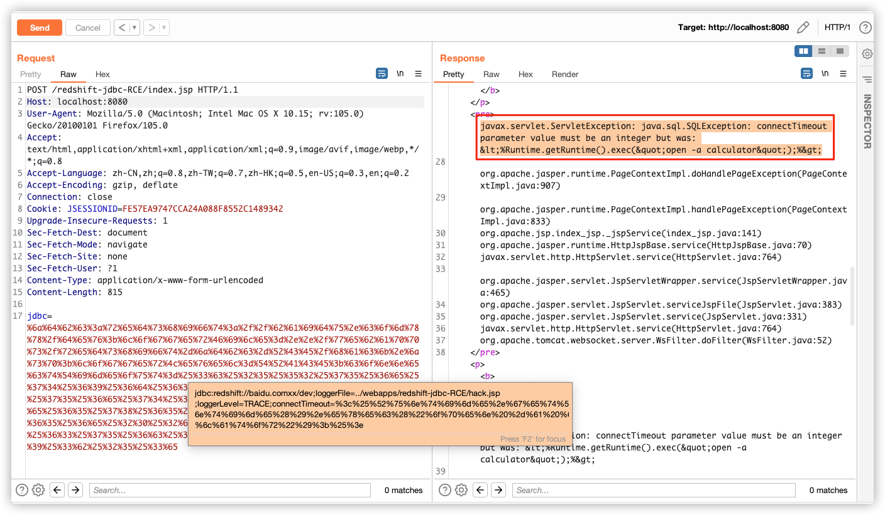
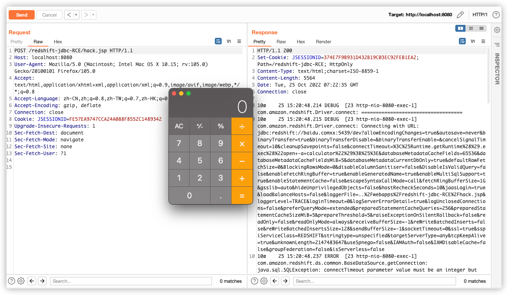

## Redshift-jdbc file write RCE
In Amazon AWS Redshift JDBC Driver (aka amazon-redshift-jdbc-driver or redshift-jdbc42) with the newest version, the loggerFile properties does not check the file suffix,which a knowledgeable attacker with control over the JDBC URL can use to create a jsp webshell and achieve remote code execution.

## Impact
version <= 2.1.0.9

## Example Code

```jsp
    // src/main/webapp/index.jsp
    String connStr = request.getParameter("jdbc");
    DataSource ds = new DataSource();
    ds.setURL(connStr);
    Connection connection = ds.getConnection();
```

## Proof
move the redshift-jdbc-RCE.war to 'tomcat/webapps/' , run the tomcat, and you will see the proof.






## For more information
If you have any questions or comments about this, please contact me at pin83r@gmail.com.


